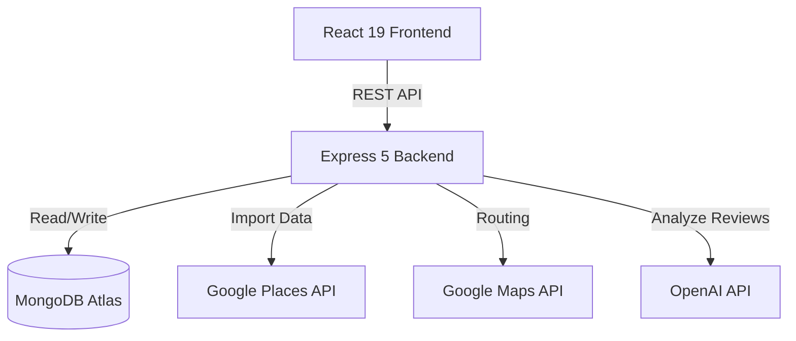

# ☕ Smart Cafe Finder

> Discover your perfect workspace. Find cafes with Wi-Fi, power sockets, and quiet environments, powered by Google Places and OpenAI.

[](https://reactjs.org/)
[](https://nodejs.org/)
[](https://www.mongodb.com/)
[](https://openai.com/)

## 🚀 Features

- **Google Places Integration:** Automatically import real cafes near your location with accurate details and photos.
- **AI-Powered Recommendations:** OpenAI generates personalized cafe rankings based on community reviews, quietness, and study suitability.
- **Smart Filtering & Text Search:** High-performance MongoDB text-index search for instantaneous filtering by city, vibe, and amenities.
- **Live Interactive Maps:** Navigate and explore cafes via the Google Maps API with route polylines.
- **Optimistic UI:** Instant favorite toggling and review submissions for a seamless user experience.
- **Production-Ready Security:** JWT authentication, Zod request validation, Helmet headers, and IP rate limiting.

## 🏗️ Architecture



## 🛠️ Tech Stack

- **Frontend:** React 19, Vite, React Router, Context API, Axios, Vanilla CSS Variables
- **Backend:** Node.js, Express 5, Mongoose, JSON Web Tokens (JWT), bcrypt, Zod
- **External Services:** Google Maps (Places, Directions), OpenAI (GPT-4o mini)
- **Security:** Helmet, express-rate-limit, cors

## 🏃‍♂️ Getting Started

### Prerequisites
- Node.js v18+
- MongoDB Atlas account
- Google Cloud Console account (for Maps API)
- OpenAI API Key

### 1. Clone the repository
```bash
git clone https://github.com/yourusername/smart-cafe-finder.git
cd smart-cafe-finder
```

### 2. Setup Backend
```bash
cd backend
npm install
```
Create a `.env` file in the `backend` directory:
```env
MONGO_URI=your_mongodb_connection_string
JWT_SECRET=a_long_secure_random_string
PORT=5000
GOOGLE_MAPS_API_KEY=your_google_maps_api_key
OPENAI_API_KEY=your_openai_api_key
FRONTEND_URL=http://localhost:5173
```
Start the backend server:
```bash
npm run dev
```

### 3. Setup Frontend
```bash
cd ../frontend
npm install
```
Create a `.env` file in the `frontend` directory:
```env
VITE_API_URL=http://localhost:5000
VITE_GOOGLE_MAPS_API_KEY=your_google_maps_api_key
```
Start the frontend development server:
```bash
npm run dev
```

## 📡 Core API Endpoints

| Method | Endpoint | Description | Auth Required |
|--------|----------|-------------|---------------|
| `POST` | `/api/auth/register` | Register a new user | No |
| `POST` | `/api/auth/login` | Login and receive JWT | No |
| `GET`  | `/api/cafes` | List cafes with text-search and filtering | No |
| `GET`  | `/api/recommendations` | Get AI-generated cafe rankings | No |
| `POST` | `/api/favorites` | Add cafe to user favorites | Yes |
| `POST` | `/api/maps/import-cafes` | Fetch & save cafes from Google Places | No |

## 📁 Folder Structure

```
smart-cafe-finder/
├── backend/
│   ├── controllers/      # Route logic
│   ├── middleware/       # Auth, validation, rate limiting
│   ├── models/           # Mongoose schemas
│   ├── routes/           # Express routers
│   ├── services/         # External API integrations
│   └── validators/       # Zod schemas
└── frontend/
    ├── src/
    │   ├── api.js        # Axios instance & endpoints
    │   ├── components/   # Reusable UI elements
    │   ├── contexts/     # Global state (Auth, Toast)
    │   └── pages/        # Route components
```
